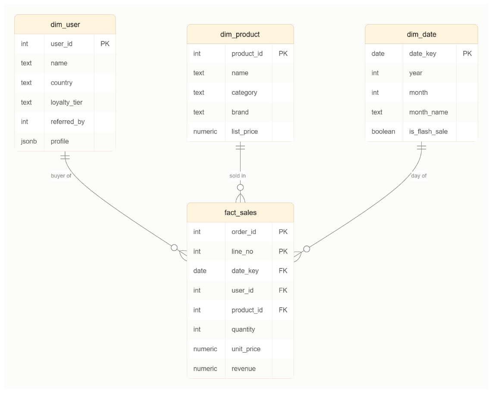
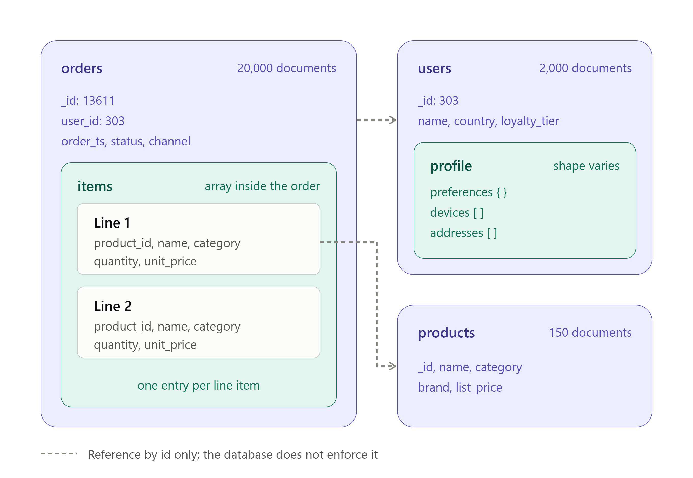
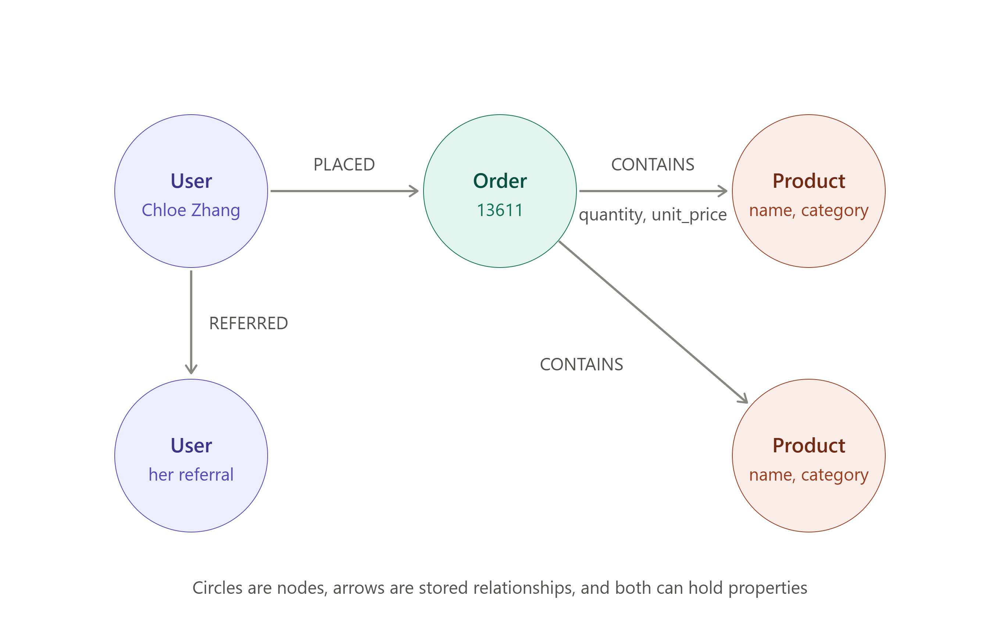

# Flash-sale demo: relational, document and graph on one dataset 

One set of users, products and orders is loaded into three databases, each in the shape that database prefers. We will ask three questions. Each question has a **natural home**, and we will execute this first, then run it in the other two systems as the twist.

| Database | Model | How it holds the data |
|---|---|---|
| Postgres | Relational schema | `fact_sales` (one row per order line) joined to `dim_user`, `dim_product`, `dim_date` |
| MongoDB | Document | `orders` with line items nested inside, `users` with a free-form `profile` |
| Neo4j | Graph | `(User)-[:REFERRED]->(User)` and `(User)-[:PLACED]->(Order)-[:CONTAINS]->(Product)` |

## Data Model



## Setup

You will need a Windows machine with Podman Desktop and its Podman machine started. No additional tools required. We may require python to run the data generator. The Podman machine needs to reach the internet for the first run, to download the three images.

1. Mount the folder somewhere simple, for example `C:\demo\flash-sale-demo`.
2. Double-click **`start.cmd`**.

The first run downloads three images via the above start script. When it finishes, all three loaders print the same totals: **2,000 users, 150 products, 20,000 orders, 56,487 order lines, 16,255,674.43 revenue**. Showing those three identical lines is a good opening: same data, three shapes.

| File | What it does |
|---|---|
| `start.cmd` | Downloads the images if needed, starts Postgres, MongoDB and Neo4j, and loads the data. |
| `seed.cmd` | Reloads the data into the running containers. Use it to reset between rehearsals. |
| `stop.cmd` | Removes the three containers. |
| `compose.yaml` | Optional alternative to `start.cmd` for `podman compose`; read the note at the top of the file first. |
| `shell-postgres.cmd`, `shell-mongo.cmd`, `shell-neo4j.cmd` | Each opens a query shell in its own window. |

The containers are named `flashsale-postgres`, `flashsale-mongo` and `flashsale-neo4j`, and they appear in the Containers list in Podman Desktop.

Tip: Please note that Windows may show a security prompt the first time you run a `.cmd` file that came from a downloaded zip; allow it to run. To avoid the prompt, right-click the zip before extracting, open Properties, and tick "Unblock".

## The dataset

Please note that this is synthetic data. Generated using a Python script and the code is available for you to tweak if needed.

The files in `data/` are the single source for all three databases. The CSV files feed Postgres and Neo4j; the `.jsonl` files hold the same records nested for MongoDB.

- **Users:** 2,000, each with a country, a loyalty tier, and (for about 70%) the user who referred them.
- **Profiles:** every user has a `profile` whose shape varies, because marketing kept adding features: preferences, devices, marketing campaign, addresses.
- **Products:** 150 across 8 categories.
- **Orders:** 20,000 over 12 months, with 3,000 of them on the 11 November 2025 flash sale at 30 to 50% off.
- **A planted fault:** users 1998, 1999 and 2000 refer each other in a loop. Act 3 uses it.

The IDs used throughout: user **303** (Chloe Zhang), order **13611** (her flash-sale order), and users **1884** and **1045** for the shortest path.

## Live Demo

Double-click the three `shell-*.cmd` files to get one window per database, then paste one numbered block at a time from the act files. The block numbers match across databases, so 1.1 is the same question everywhere.

If you prefer one Windows Terminal with three tabs, the commands are:

```powershell
podman exec -it flashsale-postgres psql -P pager=off -U postgres -d flashsale
podman exec -it flashsale-mongo mongosh flashsale
podman exec -it flashsale-neo4j cypher-shell
```

Neo4j Browser, for the graph pictures, is at http://localhost:7474. Choose "No authentication" and connect.

Acts (relevant to the three queries) are run in order. Each act file is written to run once after a fresh load; a few blocks create indexes or change data, so run `seed.cmd` before a second run.

## Act 1:  Relational Schema and NewSQL

**Query to consider: "On the 11.11 flash sale, which category and loyalty tier combinations earned the most? Which database answers this most cleanly?"**

| Step | File | What happens |
|---|---|---|
| Natural home | `postgres/act1_star.sql` 1.1 | Fact joined to two dimensions, `GROUP BY`. Top row: Electronics, bronze, 395,040.84. |
| Deliberate bug | 1.2, 1.3 | `EXPLAIN` shows a sequential scan that throws away 48,007 rows. Add the index live; the plan switches to an index scan. |
| Same shape, new slice | 1.4 | Revenue by month with one column per tier. A new question is a new `GROUP BY`. |
| Twist: MongoDB | `mongo/act1_star.js` 1.1 | Same ten rows, but it takes `$lookup` plus two `$unwind` stages to get there. |
| Twist: Neo4j | `neo4j/act1_star.cypher` 1.1 | Same ten rows by walking relationships. |
| The nuance | 1.5 (Postgres), 1.4 (MongoDB) | Rename a category. Postgres changes 19 rows. MongoDB has to rewrite 6,478 orders, because the category was copied into every line item to avoid a join. |

At this data size the index changes the plan more than the clock (a few milliseconds either way). Ask what the same plan costs at 500 million rows.

**Thought question:** "We copied the category into each order to make reads fast. Who is responsible for keeping those copies correct?"

## Act 2: Document Data

**Query to consider: "The ecommerce app needs order 13611 as one object, and marketing wants a new field on some user profiles by this afternoon. Which database makes that painless?"**

| Step | File | What happens |
|---|---|---|
| Natural home | `mongo/act2_document.js` 2.1 to 2.3 | One read by key returns the whole order. Three users show three profile shapes. 379 users have an iOS device. |
| One-line change | 2.4 | `$set` on a nested path that does not exist yet. 75 platinum users updated. |
| Twist: Postgres | `postgres/act2_document.sql` 2.1 to 2.3 | The order is rebuilt from fact rows with `jsonb_agg`. `JSONB` stores the profiles and answers the same iOS question: 379. |
| Deliberate bug | 2.4, 2.5 | `jsonb_set` reports `UPDATE 75` but changes nothing, because the parent key is missing. The count shows 0. The fix works and shows 75. |
| Twist: Neo4j | `neo4j/act2_document.cypher` | The order is rebuilt with `collect`. A flat property is easy to add; a nested profile is rejected with an error. Run 2.3 last. |
| The nuance | `mongo/act2_document.js` 2.5 | Nothing enforced a schema, so there are now 32 distinct profile shapes for the application to handle. |

**Thought question:** "The schema did not go away. Where does it live now?"

## Act 3: Graph Data

**Query to consider: "Who did Chloe bring in, three levels deep? And how are two given users connected? Show of hands: Postgres, MongoDB, or neither?"**

| Step | File | What happens |
|---|---|---|
| Twist: Postgres | `postgres/act3_graph.sql` 3.1 | A recursive query. Answer: 5, 6 and 4 people at depths 1, 2 and 3. |
| Deliberate bug | 3.2, 3.3 | The same query on user 1998 never finishes because of the loop; the 3-second timeout cancels it. `CYCLE` fixes it and returns 1999, 2000, 1998. |
| Twist: MongoDB | `mongo/act3_graph.js` 3.1, 3.2 | `$graphLookup` gives the same 5, 6, 4 and handles the loop on its own. |
| Harder question | Postgres 3.4, MongoDB 3.3 | Shortest path takes about 20 lines of SQL. MongoDB has no operator for it and can only list each person's upline. |
| Natural home | `neo4j/act3_graph.cypher` 3.1 to 3.3 | One line each. The path is 7 hops: Rohan Santoso, Sanjay Teo, Vikram Koh, Chloe Zhang, Sakura Mori, Devi Reddy, Priya Kato, Max Wilson. Show both as pictures in the Browser. |
| The payoff | 3.4 | Product recommendations from the referral network in six lines. Top result: Lumo Travel Guide F15, bought by 8 people in her network. |

Before running 3.4, challenge the room to write it in SQL. The answer is in `postgres/act3_graph.sql` 3.5 and returns the same five products.

**Thought question:** "The relationships were always in the data. What changes when the database stores them as things you can access, instead of values you have to match?"

## Scorecard

Build this on the whiteboard as you go, or reveal it at the end.

| | Postgres | MongoDB | Neo4j |
|---|---|---|---|
| **Star:** aggregate across dimensions from relational data | Natural home | Works; needs `$lookup` and `$unwind`, and copied fields must be kept in sync | Works; walks relationships, no fact table |
| **Document:** read and change one nested object | Works; rebuilds the object, nested updates are fiddly | Natural home | Rebuilds the object; nested properties not allowed |
| **Graph:** follow connections | Works; recursive SQL, loops are your problem | Works for chains; no shortest path | Natural home |

**Closing thoughts:** "All three answered almost every question. So what should decide the choice?" The answer: the access pattern you run most often, and how much of the remaining work you are willing to write and maintain yourself.

## Reset and stop
- **Reset to a clean state:** double-click `seed.cmd`.
- **Stop and remove everything:** double-click `stop.cmd`. The downloaded images stay on disk, so the next `start.cmd` is quick.
